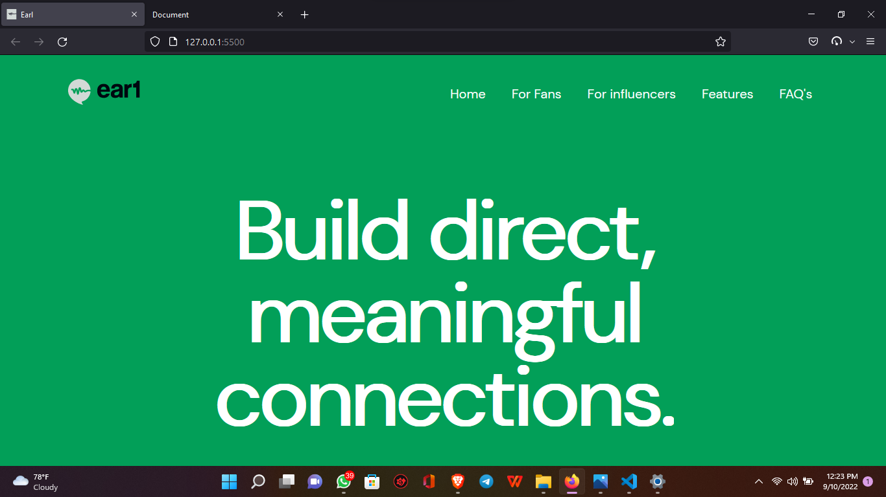

# Earl

> 

## Built With

- HTML5
- CSS3

## Live Demo

[Live Demo Link](https://deploy-preview-2--cerulean-gelato-2bc2d4.netlify.app/)

## Getting Started

To get a local copy up and running follow these simple example steps.

### Clone the repository
run this in the terminal `git clone https://www.github.com/AckonSamuel/earl.git`

### Open the directory 
run `cd <relative path>/earl/` or any other way.

### View page in the browser
Open the index.html file in the browser to view.

## Authors

👤 **Author1**

- GitHub: [@AckonSamuel](https://github.com/AckonSamuel)
- Twitter: [@AckonSamuel2](https://twitter.com/AckonSamuel2)
- LinkedIn: [Ackon Samuel](https://linkedin.com/in/samuel-yaw-ackon/)

## 🤝 Contributing

Contributions, issues, and feature requests are welcome!

Feel free to check the [issues page](../../issues/).

## Show your support

Give a ⭐️ if you like this project!

## Acknowledgments

- I got all the template colors, font, layout distribution for the whole project [here](https://www.figma.com/file/IuP65ODyCcBW6ACWDjElPG/Frontend-Challenge?node-id=0%3A1) on Figma.

## 📝 License

This project is [MIT](./MIT.md) licensed.
